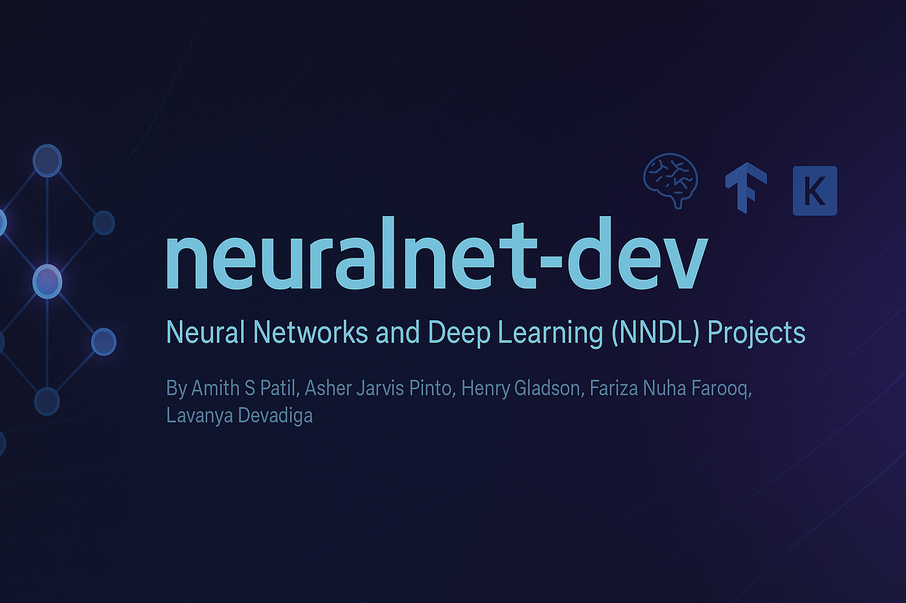

  

<h1 align="center">neuralnet-dev</h1>

  A collaborative deep learning portfolio by students of the Neural Networks and Deep Learning (NNDL) course.

---

### Contributors

- Amith S Patil  
- Asher Jarvis Pinto  
- Henry Gladson  
- Fariza Nuha Farooq  
- Lavanya Devadiga  

---

### Repository Overview

This organization hosts a growing collection of practical projects focused on neural networks and deep learning. 

---

### Tools and Frameworks

Core technologies used:

- TensorFlow, Keras – Deep learning  
- Scikit-learn – Classical machine learning  
- NumPy, Pandas – Data processing  
- Matplotlib, Seaborn, Plotly – Visualization  
- Jupyter Notebooks – Interactive development  

---

### Vision

**neuralnet-dev** is a collaborative space for building practical AI solutions, experimenting with modern neural architectures, and applying deep learning concepts beyond the classroom.

---

### Usage

**Copyright [NEURALNET-DEV] [2025]. All rights reserved.**